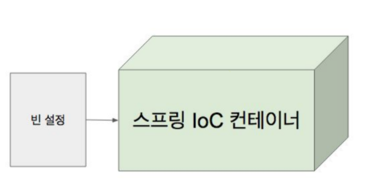

# IoC 컨테이너와 빈

Inversion of Control : 의존 주입(Dependency Injection)이라고도 하며, 어떤 객체가 사용하는 **의존 객체를 직접 만들어 사용하는게 아니라, 주입 받아 사용하는 방법**

### 스프링 IoC 컨테이너

- BeanFactory
  - 스프링 IoC 컨테이너의 가장 최상위 인터페이스
  - 그외에도 AppilicationEventPulisher, EnvironmentCapable, HierarchicalBeanFactory, MessageSource, ResourceLoader, ResourcePatternResolver
- 애플리케이션 컴포넌트의 중앙 저장소
- **빈 설정 소스**로 부터 **빈 정의**를 읽어들이고, **빈을 구성하고 제공**한다.
- IoC 컨테이너를 사용하는 이유
  - 여러 DI, 베스트 프렉틱스들이 노하우가 쌓여있기 때문에
  - 컨테이너와 빈을 설계할 때 아주 많은 개발자들의 의견을 바탕으로 만들어졌다
  - 스프링 초기에는 XML로 설정하는게 대세였지만 구글 주스가 선보인 어노테이션 기반 DI를 선보이기 시작했다
- 컨테이너로부터 빈을 가져와서 사용할 수 있다

### 빈

- 스프링 IoC 컨테이너가 관리하는 객체
  - IoC컨테이너가 관리하는 객체가 아니면 빈이 아니다
- 의존성 주입을 하고 싶으면 빈이여야 한다.
- 빈의 Scope(싱글톤 Scope)으로 관리하고 싶을 때 IoC 컨테이너에 빈으로 등록하면 됨
  - 싱클톤이 아닌것? 프로토타입
- Scope
  - 싱글톤 : 하나 -> 런타임시 성능 최적화에 좋음
    - 데이터 베이스와 연결된 Repository 같은 경우 성능 좋음
  - 프로토 타입 : 매번 다른 객체
- 라이프사이클 인터페이스
  - IoC 컨테이너에 등록된 빈들에게만 해당

- 장점 정리
  - 의존성 관리
  - 스코프
  - 라이프사이클

### ApplicationContext

- BeanFactory
- 메시지 소스 처리기능(i18n)
- 이벤트 발행기능
- 리소스 로딩기능

