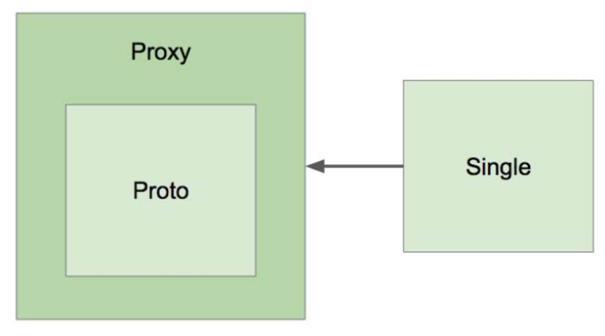

# 빈의 스코프

### 스코프

- 싱글톤
  - 애플리케이션 전반에 걸쳐 해달 빈의 인스턴스가 오직 1개 뿐
- 프로토타입 : 매번 새로운 타입을 만들어서 쓰는 것
  - Request
  - Session
  - WebSocke
  - ...


### 싱글톤과 프로토타입

- 프로토 타입 빈이 싱글톤 빈을 참조하면?
  - 아무 문제 없음

```java
@Component @Scope("prototype")
public class Proto{
  
  @Autowired
  Single signle;
}
```

- 싱글톤 빈이 프로토타입 빈을 참조하면?

```java
@Component
public class Single{
	@Autowired
	private Proto proto;
	
	public Proto getProto(){
		return proto;
	}
}
....
  ApplicationContext ctx;
  ctx.getBean(Single.class).getProto() => 이때 proto의 객체가 바뀌지 않음음ㅌ
```

- 프로토 타입 빈이 업데이트가 안되네?

  - proxyMode 설정

    ```
    @Component @Scope(value="prototype", proxyMode=ScopedProxyMode.TARGET_CLASS)
    public class Proto{
    ...
    }
    ```

    - TARGET_CLASS 를 선택하면 CG라이브러리를 활용한 프록시가 설정이 됨
    - INTEFACE 를 선택하면 JDK?

  - proxyMode 란?

    - 프록시로 감싸라
    - 클래스 기반의 프록시로 감싸라 빈을
    - 다른 빈들이 사용할 때 프록시로 감싼 빈을 사용하게 해라

  - 왜 프록시로 감싸야 하나?

    - 싱글 스코프 인스턴스들이 프로토 객체를 직접 참조하면 안돼기 때문에
    - 프록시를 거쳐서 참조 해야한다
      - 프록시가 매번 새로운 인스턴스로 바꿔주기 때문에
    - CG 라이브러리 -> 클래스도 프록시도 만들게 해줌, 서드파티
      - 기존 JDK안에 있는 프록시는 인터페이스만 프록시를 만들 수 있다
      - 클래스 기반 프록시를 만들어 CG라이브러리 기반의 클래스를 상속받은 프록시를 만들라는 것을 proxyMode로 명시

  - ProxyMode를 사용하는게 성능에 영향을 미칠것 같다면....

    ```java
    @Component
    public class Signle{
    	@Autowired
    	private ObjectProvider<Proto> proto;
    	
    	public Proto getProto(){
    		return proto.getIfAvailable();
    	}
    }
    ```

- 업데이트 하면

  - scoped-proxy
  - Object-Provide
  - Provide(표준)


### 프록시




### 주의점

- 프로퍼티가 공유
  - Thread -safe 할거라고 보장 할 수가 없다
- ApplicationContext 초기 구동시 인스턴스 생성
  - 모든 싱글통 스콥의 빈들은 기본 값이 ApplicationContext를 만들때 생성된다

